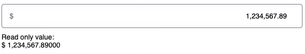

# React component formatting numbers in an input field

[](https://github.com/CharlesCoqueret/react-amount/issues)
[](https://github.com/CharlesCoqueret/react-amount/blob/master/LICENSE.txt)
[](https://coveralls.io/github/CharlesCoqueret/react-amount?branch=master)

## Live demo

[Live demo on CodeSandbox](https://codesandbox.io/s/demo-react-amount-640ii?file=/src/App.tsx)



## Installation

```
yarn add react-amount
```

or

```
npm install react-amount
```

## Usage

```typescript
import React, { useState } from 'react';
import { Amount } from 'react-amount';

import '~/react-amount/dist/style/index.min.css';

interface MyComponentProps {
  value: string | number | undefined;
}

const MyComponent = (props: MyComponentProps): React.Element => {
  const { value } = props;

  const [currentValue, setCurrentValue] = useState<string | number | undefined>(
    value,
  );

  return (
    <Amount
      value={currentValue}
      suffix="€"
      onChange={(newValue) => setCurrentValue(newValue.raw)}
      decimalSeparator=","
      thousandSeparator=" "
    />
  );
};

export default MyComponent;
```

## Options

|      Option       |                                      Type                                      | Default value | Description                                           |
| :---------------: | :----------------------------------------------------------------------------: | :-----------: | ----------------------------------------------------- |
|       value       |                                string \| number                                |   undefined   | Initial value of the control                          |
|     readOnly      |                                    boolean                                     |     false     | Input value is not editable                           |
|     disabled      |                                    boolean                                     |     false     | Input value is disabled                               |
|     textOnly      |                                    boolean                                     |     false     | Input value is displayed as formatted text only value |
|       name        |                                     string                                     |               | Name of the input field                               |
|     className     |                                     string                                     |   undefined   | Class to be added to the wrapper of the component     |
|     onChange      |             (update: [FormattedValues](#FormattedValues)) => void              |   undefined   | Callback function to handle value changes             |
|     decimals      |                                     number                                     |       2       | Number of decimals                                    |
| decimalSeparator  |                                     string                                     |      "."      | Decimal separator                                     |
| thousandSeparator |                                     string                                     |      ","      | Thousand separator                                    |
| thousandGrouping  | [ThousandGroupingStyle](#ThousandGroupingStyle): "thousand" \| "wan" \| "lakh" |  "thousand"   | Thousand grouping style                               |
| displayOnInvalid  |                                     string                                     |      "-"      | Value displayed on invalid input in textOnly          |
|    dataTestId     |                                     string                                     |   undefined   | Id value for testing                                  |
|     required      |                                    boolean                                     |     false     | Required of the input field                           |
|      prefix       |                                     string                                     |   undefined   | Prefix                                                |
|      suffix       |                                     string                                     |   undefined   | Suffix                                                |

## Contributing

We very much welcome contributions.

- Submit [GitHub issues](http://github.com/CharlesCoqueret/react-amount/issues) to report bugs or ask questions.
- Propose [Pull Request](http://github.com/CharlesCoqueret/react-amount/pulls) to improve our code.

## Types

### FormattedValues

```typescript
export interface FormattedValues {
  formatted: string;
  float: number;
  raw: string;
}
```

This structure is used in the onChange handler to provide flexibility on the format.

- `formatted` is for display purpose.
- `float` is for numerical representation, but suffer from precision limitations.
- `raw` is for numerical representation as a string with full precision.

### ThousandGroupingStyle

```typescript
export enum ThousandGroupingStyle {
  THOUSAND = 'thousand',
  WAN = 'wan',
  LAKH = 'lakh',
}
```

- `THOUSAND`: groups of 3 digits
  example: 123,456,789
- `WAN`: 1 group of 4 digits, then groups of 3 digits
  example: 12,345,6789
- `LAKH`: 1 group of 3 digits, then groups of 2 digits
  example: 12,34,56,789
